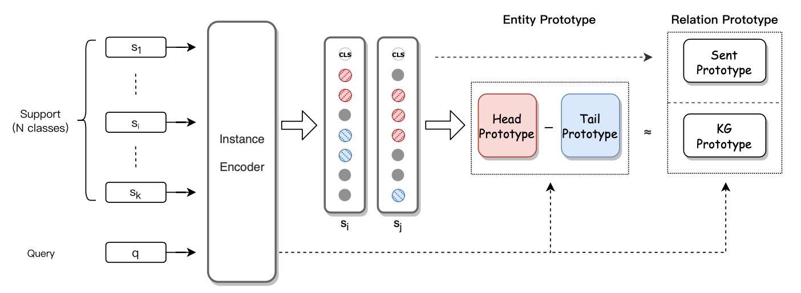

# Bridging Text and Knowledge with Multi-Prototype Embedding for Few-Shot Relational Triple Extraction

COLING 2020

## 一句话概括

本文通过设计了一种**混合原型学习机制**和**基于原型的正则化方法**来同时抽取关系和实体来获取三元组信息。

关键字：Multi-Prototype Embedding = Multi-embedding for prorotype

## 本文贡献

1. 提出了一个新的研究方向：小样本场景下联合抽取关系和实体，而不是分开来做。并提供了一个baseline。
2. 提出了一个新的Multi-Prototype Embedding方法和prorotype-aware regularization方法，来桥接文本和知识。
3. 提出的方法很有效

## 模型方法

### 模型架构图

### 模型组件

- Instance Encoder：直接用BERT
- Hybrid Prototype Learning：基于knowledge graph constraint，考虑了实体对和关系的交互
- Prototype-Aware Regularization：优化表示空间中prototype的分布

### Hybrid Prototypical Learning

- Entity Prototype Learning：基于CRF去优化
  - 之前每个prototype的表示，是认为所有的instance权重相同，这不合理，应该有不同的权重，自动学习
  - $head_{proto} = \frac{1}{S_k} \sum_{head_i \in S_k} \alpha_h head_i$
  - $tail_{proto} = \frac{1}{S_k} \sum_{tail_i \in S_k} \alpha_t tail_i$
- Relation Prototype Learning：句子表示 + knowledge graph表示
  - knowledge graph表示学习：h = 第一个实体（head entity），t = 第二个实体（tail entity），r = 关系（relation），该表示学习学习的目标是 $h + r \approx t$。
  - $kg_{proto} = |head_{proto} - tail_{proto}| W_r$
  - $relation_{proto} = [sent_{proto};kg_{proto}]$

### Prototype-Aware Regularization

核心思想：

- 同类的instance应该尽可能靠近，从而使得prototype能表示的更好

$$
Loss_{intra} = \frac{1}{NK} \sum_{i=1}^{N} \sum_{k=1}^{K} \| x_i^k - p_i^k \|^2_2
$$

- 不同的prototype之间应该尽可能的远，从而使得prototype在空间中的分布更好更可分

$$
Loss_{inter} = 1 - \frac{1}{N} \sum_{i=1}^{N} \sum_{j=i+1}^{N} cosine(p_i, p_j)
$$

