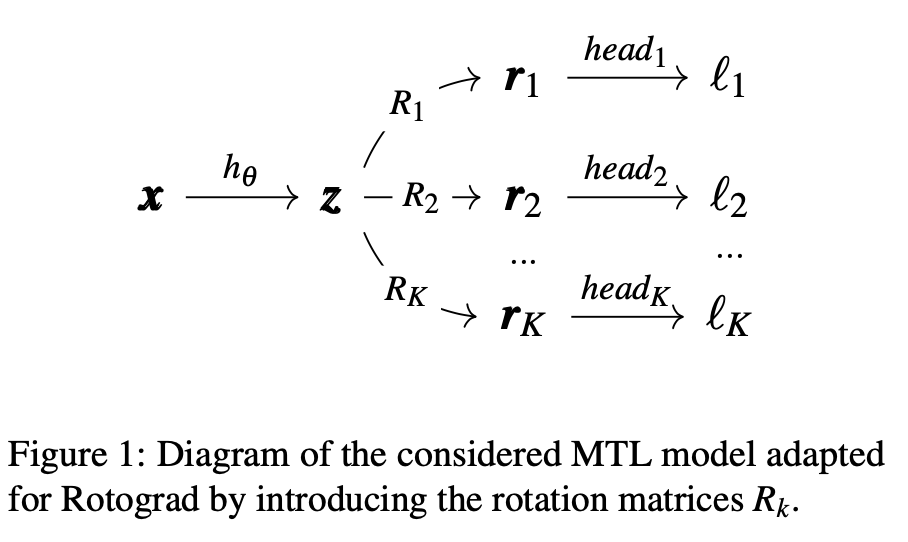

# Rotograd: Dynamic Gradient Homogenization for Multi-Task Learning

## 一句话总结

提出了一个新方法，用于解决多任务学习（MTL）中的Negative Transfer问题（或者是Gradient Conflict问题）。

## 背景

1. 多任务学习，在任务相关的时候，能够提升各自的性能，因此其被广泛应用。
2. 多任务学习，毕竟是多个任务，那么他们各自任务的一个optimal必然是不一样的，这就会导致不同的任务在优化的过程中，其各自最优的一个梯度方向是不同的。
3. 多任务学习，一般他们的表示层都是共享的，那么共享的参数的优化，梯度方向只能是一个。
4. 如果多个任务的梯度方向差异很大的或完全相反，即有冲突，那么共享的参数的梯度方向可能就会由于这种冲突而变得非常差。（可以想象鞍点所处的情景）（这就是Negative Transfer问题）
5. 如何缓解Negative Transfer问题很重要也很有意义。

## Negative Transfer问题的深入分析

#### Gradient Magnitude角度

多个任务，他们最终都是优化一个目标函数，他们的目标函数如下：
$$
L(t) = \sum_{k=1}^K w_k L_k(t)
$$

，梯度向量如下：
$$
\nabla L(t) = \sum_{k=1}^K w_k \nabla  L_k(t)
$$

。
由此可见，共享参数的梯度是受各个任务的梯度影响的。那么如果不同任务的梯度量级不一样，对共享参数梯度的影响是非常大的。

因此，防止某个任务的梯度量级过大而主导整个的模型的梯度是很重要的。

有一些工作在这方面针对性地调整了各个任务的权重从而平衡各个任务的梯度。

但是这些方法无法解决不同任务梯度方向不一致的问题。

#### Gradient Direction角度

任务的方向不一致，有些工作通过梯度映射或者是引入正则化项来解决这个问题。

但是这些方法仅仅只操作了单个任务的梯度，或者它们是如何组合的，以改进接下来的更新方向。

## 主要内容

#### Rotograd

核心思想：每个任务都通过一个旋转变量（参数$R_k$）来将得到的共享的表示层进行旋转，使得每个任务的梯度方向尽可能一致。

#### 所需要解决的问题

1. 如何训练才能确保模型能够稳定且可收敛的？
2. 参数$R_k$的目的是为了让共享表示层进行旋转，这个参数该如何设置呢？

#### 确保模型训练稳定课收敛

明确需要优化的东西，有如下两个：
- MTL模型的参数
- 旋转参数

通过引入Stackelberg Games，来同时优化这两个东西。它可以分为一个leader和一个follower，leader能够知道follower的一些信息，从而来优化自己，follower自己优化自己。这样leader和follower就能迭代到一个平衡状态。

其优化公式如下：

而且有一个推理：当leader的学习率比follower的学习率能更快地趋于0的时候，一定存在一个可微的stackelberg平衡点。

#### 参数$R_k$的设定

因为是旋转矩阵，因此有$det(R_k) = 1$， 所以采用 Lezcano-Casado and Martínez-Rubio所提出的方法（我也没去深入看），并将其给参数化为skew-symmetrical矩阵的一个指数图。

## 实验结果

#### 优化方向上的影响

#### Leader任务的学习率的影响

